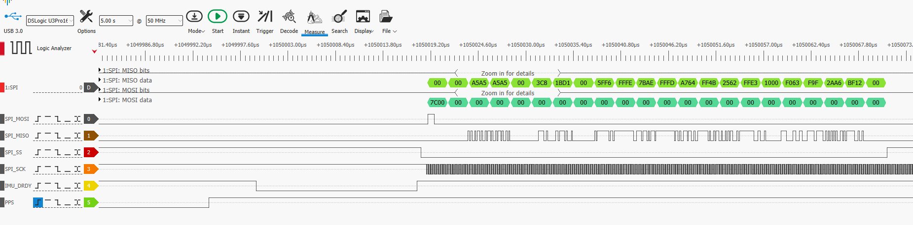

Hardware and Code
==================

Key Goals
-------------

Options
--------
.. _hwcodeOptions:

.. table:: Platforms

    ============= =============== ======= ===========
    Platform      Self-Contained?  Cost   Flexibility
    ============= =============== ======= ===========
    Monarch1          Yes          $2000    Limitless
    Jetson            Yes          $500     Nvidia
    ============= =============== ======= ===========

.. list-table:: Platforms
    :widths: 20 10 10 5
    :header-rows: 1

    * - Platform
      - Self-Contained
      - Cost
      - Flexibility
    * - Monarch1
      - No 
      - $3000
      - Limitless
    * - Jetson
      - Yes
      - $400
      - Nvidia

.. csv-table:: Platforms
    :header: Platform,Self-Contained, Cost, Flexibility
    :widths: 15 10 30 30

    Monarch1,No,$3000,Limitless
    Jetson,Yes,$400,Nvidia

    
Raspberry Pi(Family)
~~~~~~~~~~~~~~~~~~~~

Here's what a Raspberry Pi 2 and a Sense HAT look like:

.. image:: /images/Monarch1_1.jpg

With these, you can do cool things like program your own
version of Connect-4 -- you will need to consider how to check
for a win by evaluating options as shown in the diagram below:

Lego Mindstorms
~~~~~~~~~~~~~~~~~~~~